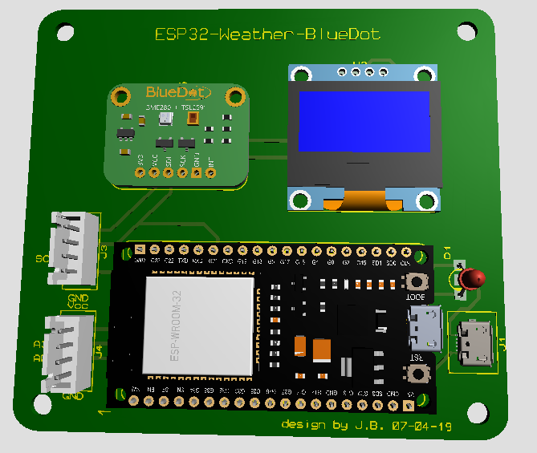

# Programmation [websocket](https://fr.wikipedia.org/wiki/WebSocket)

- [Programmation websocket](#programmation-websocket)
  - [Présentation](#présentation)
  - [Python](#python)
    - [Serveur (echo)](#serveur-echo)
    - [Client](#client)
  - [Qt](#qt)
    - [Serveur (echo)](#serveur-echo-1)
    - [Client](#client-1)
  - [PHP](#php)
    - [Serveur (echo)](#serveur-echo-2)
    - [Client](#client-2)
  - [ESP32](#esp32)
    - [Serveur (echo)](#serveur-echo-3)
    - [IoT](#iot)
  - [HTML](#html)
    - [Client](#client-3)
  - [Android](#android)
    - [Client](#client-4)
  - [CLI](#cli)
  - [Protocole WebSocket (_handshake_)](#protocole-websocket-handshake)
  - [Auteurs](#auteurs)

---

## Présentation

Il s'agit de mettre en oeuvre la programmation réseau en utilisant les [websockets](https://fr.wikipedia.org/wiki/WebSocket).

[Websocket](https://fr.wikipedia.org/wiki/WebSocket) est un standard du Web désignant un protocole réseau de la couche [APPLICATION](https://fr.wikipedia.org/wiki/Couche_application) et une interface de programmation du _World Wide Web_ visant à créer des **canaux de communication full-duplex** par-dessus une connexion [TCP](https://fr.wikipedia.org/wiki/Transmission_Control_Protocol) pour les navigateurs web.

Le [protocole](#protocole-websocket-handshake) **WebSocket** permet :

- la notification au client d'un changement d'état du serveur,
- l'envoi de données en mode « pousser » (méthode _Push_) du serveur vers le client, sans que ce dernier ait à effectuer une requête.

Pour utiliser les [Websocket](https://fr.wikipedia.org/wiki/WebSocket), vous avez besoin d'un serveur [Websocket](https://fr.wikipedia.org/wiki/WebSocket) qui implémente le protocole côté serveur et d'une bibliothèque ou d'un client [Websocket](https://fr.wikipedia.org/wiki/WebSocket) côté client pour établir la communication. Une fois la connexion établie, vous pouvez envoyer et recevoir des messages en utilisant un format de données tel que le JSON ou le texte brut.

Quelques liens sur les notions de base :

- le standard [WebSockets](https://websockets.spec.whatwg.org/)
- la RFC [6455](https://www.rfc-editor.org/rfc/rfc6455)
- l'interface [websocket](https://fr.wikipedia.org/wiki/WebSocket)
- l'architecture [client/serveur](https://fr.wikipedia.org/wiki/Client-serveur)
- le modèle [TCP/IP](https://fr.wikipedia.org/wiki/Suite_des_protocoles_Internet) ou DoD
- la couche [APPLICATION](https://fr.wikipedia.org/wiki/Couche_application)
- la couche [TRANSPORT](https://fr.wikipedia.org/wiki/Couche_transport)
- la couche [RÉSEAU](https://fr.wikipedia.org/wiki/Couche_r%C3%A9seau)
- le protocole [TCP](https://fr.wikipedia.org/wiki/Transmission_Control_Protocol)
- le protocole [UDP](https://fr.wikipedia.org/wiki/User_Datagram_Protocol)
- le protocole [HTTP](https://fr.wikipedia.org/wiki/Hypertext_Transfer_Protocol)

Quelques bibliothèques logicielles :

- Javascript : [WebSocket](https://developer.mozilla.org/fr/docs/Web/API/WebSocket)
- C : [libwebsockets](https://libwebsockets.org/)
- C++ : [websocketpp](https://github.com/zaphoyd/websocketpp)
- Qt : [QtWebsocket](https://doc.qt.io/qt-5/qtwebsockets-index.html)
- Python : [websockets](https://pypi.org/project/websockets/), [pywebsocket](https://github.com/googlearchive/pywebsocket)
- Node.js : [Socket.io](https://socket.io/), [ws](https://www.npmjs.com/package/ws)
- PHP : [textalk/websocket](https://github.com/Textalk/websocket-php)

## Python

Pré-requis : bibliothèque [websockets](https://pypi.org/project/websockets/)

```bash
$ sudo apt install python3 python3-pip python3-venv
$ pip install websockets
```

### Serveur (echo)

- Version 1 :

```python
#!/usr/bin/env python3

import asyncio
import websockets

async def echo(websocket):
    async for message in websocket:
        print(f"< {message}")
        await websocket.send(message)
        print(f"> {message}")

async def main():
    async with websockets.serve(echo, "localhost", 5000):
        await asyncio.Future()  # run forever

asyncio.run(main())
```

Test :

```bash
$ chmod +x ./serveur-echo-v1.py
$ ./serveur-echo-v1.py
< Hello world!
> Hello world!
```

- Version 2 :

```python
#!/usr/bin/env python3

import asyncio
import websockets

async def echo(websocket):
    donneesRecues = await websocket.recv()
    print(f"< {donneesRecues}")
    await websocket.send(donneesRecues)
    print(f"> {donneesRecues}")

serveur = websockets.serve(echo, "localhost", 5000)
asyncio.get_event_loop().run_until_complete(serveur)
asyncio.get_event_loop().run_forever()
```

Test :

```bash
$ chmod +x ./serveur-echo-v2.py
$ ./serveur-echo-v2.py
< Hello world!
> Hello world!
```

### Client

- Version 1 :

```python
#!/usr/bin/env python3

import asyncio
from websockets.sync.client import connect

def hello():
    with connect("ws://localhost:5000") as websocket:
        message = f"Hello world!"
        print(f"> {message}")
        websocket.send(message)
        message = websocket.recv()
        print(f"< {message}")

hello()
```

Test :

```bash
$ chmod +x ./client-echo-v1.py
$ ./client-echo-v1.py
> Hello world!
< Hello world!
```

- Version 2 :

```python
#!/usr/bin/env python3
import asyncio
import websockets

async def hello():
    async with websockets.connect("ws://localhost:5000") as websocket:
        message = f"Hello world!"
        print(f"> {message}")
        await websocket.send(message)
        message = await websocket.recv()
        print(f"< {message}")

asyncio.get_event_loop().run_until_complete(hello())
```

Test :

```bash
$ chmod +x ./client-echo-v2.py
$ ./client-echo-v2.py
> Hello world!
< Hello world!
```

Liens :

- l'API Python [websockets](https://pypi.org/project/websockets/)
- l'API JavaScript [WebSocket](https://developer.mozilla.org/en-US/docs/Web/API/WebSocket)
- Tutoriel Python : https://websockets.readthedocs.io/en/stable/intro/index.html
- Tutoriel JavaScript : https://javascript.info/websocket

## Qt

Pré-requis : module [QtWebsocket](https://doc.qt.io/qt-5/qtwebsockets-index.html)

```bash
$ sudo apt install -y qtcreator qtbase5-dev qt5-qmake cmake
$ sudo apt install libqt5websockets5-dev
```

Activer le module dans le fichier du projet `.pro` :

```bash
QT += websockets
```

### Serveur (echo)

```cpp
#include <QCoreApplication>
#include <QObject>
#include <QtWebSockets>

int main(int argc, char* argv[])
{
    QCoreApplication a(argc, argv);

    QWebSocketServer webSocketServer(QString("Serveur Echo"), QWebSocketServer::NonSecureMode);
    int              port = 5000;

    if(webSocketServer.listen(QHostAddress::Any, port))
    {
        qDebug() << Q_FUNC_INFO << "Serveur en écoute sur le port" << port;
        QObject::connect(&webSocketServer,
                         &QWebSocketServer::newConnection,
                         [&webSocketServer]()
                         {
                             qDebug() << Q_FUNC_INFO << "Connexion établie";
                             QWebSocket* pWebSocket = webSocketServer.nextPendingConnection();
                             QObject::connect(pWebSocket,
                                              &QWebSocket::textMessageReceived,
                                              [pWebSocket](const QString& message)
                                              {
                                                  qDebug() << "< " << message;
                                                  pWebSocket->sendTextMessage(message);
                                                  qDebug() << "> " << message;
                                              });
                             QObject::connect(pWebSocket,
                                              &QWebSocket::disconnected,
                                              [pWebSocket]()
                                              {
                                                  qDebug() << "Connexion fermée";
                                              });
                         });
        QObject::connect(&webSocketServer,
                         &QWebSocketServer::closed,
                         []()
                         {
                             qDebug() << Q_FUNC_INFO << "Serveur fermé";
                         });
    }

    // webSocketServer.close();

    return a.exec();
}
```

Test :

```bash
$ qmake
$ make
g++ -c -pipe -O2 -std=gnu++11 -Wall -Wextra -D_REENTRANT -fPIC -DQT_NO_DEBUG -DQT_WEBSOCKETS_LIB -DQT_NETWORK_LIB -DQT_CORE_LIB -I. -I/usr/include/x86_64-linux-gnu/qt5 -I/usr/include/x86_64-linux-gnu/qt5/QtWebSockets -I/usr/include/x86_64-linux-gnu/qt5/QtNetwork -I/usr/include/x86_64-linux-gnu/qt5/QtCore -I. -I/usr/lib/x86_64-linux-gnu/qt5/mkspecs/linux-g++ -o main.o main.cpp
g++ -Wl,-O1 -o serveur-echo.out main.o   /usr/lib/x86_64-linux-gnu/libQt5WebSockets.so /usr/lib/x86_64-linux-gnu/libQt5Network.so /usr/lib/x86_64-linux-gnu/libQt5Core.so -lpthread 

$ ./serveur-echo.out
int main(int, char**) Serveur en écoute sur le port 5000
main(int, char**)::<lambda()> Connexion établie
<  "Hello world!"
>  "Hello world!"
```

### Client

```cpp
#include <QCoreApplication>
#include <QtWebSockets>

int main(int argc, char* argv[])
{
    QCoreApplication a(argc, argv);

    QWebSocket webSocket;
    QObject::connect(&webSocket,
                     &QWebSocket::connected,
                     [&webSocket]()
                     {
                         qDebug() << "Connexion établie";
                         QString message = "Hello world!";
                         webSocket.sendTextMessage(message);
                         qDebug() << "> " << message;
                     });

    QObject::connect(&webSocket,
                     &QWebSocket::textMessageReceived,
                     [](const QString& message)
                     {
                         qDebug() << "< " << message;
                     });

    QObject::connect(&webSocket,
                     &QWebSocket::disconnected,
                     [&webSocket]()
                     {
                         qDebug() << "Connexion fermée";
                         QCoreApplication::quit();
                     });

    webSocket.open(QUrl("ws://localhost:5000/"));

    return a.exec();
}
```

Test :

```bash
$ qmake
$ make
g++ -c -pipe -O2 -std=gnu++11 -Wall -Wextra -D_REENTRANT -fPIC -DQT_NO_DEBUG -DQT_WEBSOCKETS_LIB -DQT_NETWORK_LIB -DQT_CORE_LIB -I. -I/usr/include/x86_64-linux-gnu/qt5 -I/usr/include/x86_64-linux-gnu/qt5/QtWebSockets -I/usr/include/x86_64-linux-gnu/qt5/QtNetwork -I/usr/include/x86_64-linux-gnu/qt5/QtCore -I. -I/usr/lib/x86_64-linux-gnu/qt5/mkspecs/linux-g++ -o main.o main.cpp
g++ -Wl,-O1 -o client-echo main.o   /usr/lib/x86_64-linux-gnu/libQt5WebSockets.so /usr/lib/x86_64-linux-gnu/libQt5Network.so /usr/lib/x86_64-linux-gnu/libQt5Core.so -lpthread

$ ./client-echo.out
Connexion établie
>  "Hello world!"
<  "Hello world!"
```

Exemples Qt : https://doc.qt.io/qt-5/qtwebsockets-examples.html

## PHP

Pré-requis : bibliothèque [textalk/websocket](https://github.com/Textalk/websocket-php)

```bash
$ sudo apt install php-cli composer
$ composer require textalk/websocket
```

### Serveur (echo)

```php
#!/usr/bin/env php
<?php
require('vendor/autoload.php');

use WebSocket\Server;

$options = array_merge([
    'port'          => 5000,
    'timeout'       => 200,
    'filter'        => ['text', 'binary', 'ping', 'pong', 'close'],
], getopt('', ['port:', 'timeout:', 'debug']));
$serveur = new WebSocket\Server($options);
$serveur->accept();

$message = $serveur->receive();
echo "< $message".PHP_EOL;
$serveur->text($message);
echo "> $message".PHP_EOL;

$serveur->close();
?>
```

Test :

```bash
$ chmod +x ./serveur-echo.php
$ ./serveur-echo.php
< Hello world!
> Hello world!
```

### Client

```php
#!/usr/bin/env php
<?php
require('vendor/autoload.php');

use WebSocket\Client;

$client = new WebSocket\Client("ws://localhost:5000");

$message = "Hello world!";
echo "> $message".PHP_EOL;
$client->text($message);
echo "< ".$client->receive().PHP_EOL;

$client->close();
?>
```

Test :

```bash
$ chmod +x ./client-echo.php
$ ./client-echo.php
> Hello world!
< Hello world!
```

## ESP32

### Serveur (echo)

```ini
[env:lolin32]
platform = espressif32
board = lolin32
framework = arduino
lib_deps =
  links2004/WebSockets @ ^2.4.1
  https://github.com/tzapu/WiFiManager.git
  thingpulse/ESP8266 and ESP32 OLED driver for SSD1306 displays @ ^4.2.0
upload_port = /dev/ttyUSB0
upload_speed = 115200
monitor_port = /dev/ttyUSB0
monitor_speed = 115200
```

```cpp
/**
 * @file src/main.cpp
 * @brief Programme principal
 * @author Thierry Vaira
 * @version 0.1
 */
#include <Arduino.h>
#include <WiFi.h>
#include <WiFiManager.h>
#include <WebSocketsServer.h>
#include <afficheur.h>

#define PORT 5000

WebSocketsServer webSocket = WebSocketsServer(PORT);
WiFiManager      wm;

/**
 * @brief Gestion des évènements (websocket)
 */
void webSocketEvent(uint8_t num, WStype_t type, uint8_t* payload, size_t length)
{
    switch(type)
    {
        case WStype_DISCONNECTED:
            Serial.printf("[%u] Déconnecté\n", num);
            break;
        case WStype_CONNECTED:
        {
            IPAddress ip = webSocket.remoteIP(num);
            Serial.printf("[%u] Connecté à l'adresse IP : %d.%d.%d.%d\n",
                          num,
                          ip[0],
                          ip[1],
                          ip[2],
                          ip[3]);
        }
        break;
        case WStype_TEXT:
            Serial.printf("< %s\n", payload);
            webSocket.sendTXT(num, payload);
            Serial.printf("> %s\n", payload);
            break;
    }
}

/**
 * @brief Initialise les ressources du programme
 */
void setup()
{
    Serial.begin(115200);
    while(!Serial)
        ;

    WiFi.mode(WIFI_STA);
    wm.setTitle("Serveur Echo (websocket)");
    bool res = wm.autoConnect();
    if(!res)
    {
        Serial.println("Erreur de connexion WiFi !");
        // ESP.restart();
    }

    webSocket.begin();
    webSocket.onEvent(webSocketEvent);
}

/**
 * @brief Boucle infinie d'exécution du programme
 */
void loop()
{
    webSocket.loop();
}
```

Pour configuration le WiFi :

a. Allumer l'ESP32
b. Avec un terminal WiFi (mobile, tablette, etc.), il faut se connecter au point d'accès de l'ESP32 (ESP32_XXYYZZ)
c. À partir de la page web de configuration, il faut renseigner le SSID et le mot de passe Wifi puis sauvegarder
d. Redémarrer l'ESP32 et vérifier son adresse IP à partir du moniteur série ou de son écran embarqué.

Test :

```bash
...
*wm:AutoConnect: SUCCESS
*wm:STA IP Address: 192.168.1.38
[0] Connecté à l'adresse IP : 192.168.1.23
< Hello world!
> Hello world!
[0] Déconnecté
```

### IoT

La carte ESP32-Wheather-Bluedot est une sonde construite autour d'un ESP32 et équipée d'un module **BlueDot** I2C, qui intègre un capteur d'éclairement lumineux **TSL 2591** et un capteur **BME280** (température, humidité et pression atmosphétrique), d'une led bicolore (rouge/verte) et d'un écran **SSD1306** I2C.



Le brochage est le suivant :

```cpp
#define GPIO_LED_ROUGE   17   //!< Led bicolore (rouge relié sur GPIO 17)
#define GPIO_LED_VERTE   16   //!< Led bicolore (vert relié sur GPIO 16)
#define ADRESSE_I2C_OLED 0x3c //!< Adresse I2C de l'OLED SSD1306
#define BROCHE_I2C_SDA   21   //!< Broche SDA
#define BROCHE_I2C_SCL   22   //!< Broche SCL
```

Les données de la carte ESP32-Weather sont transmises en _broadcast_ au format JSON via la websocket :

```json
{"luminosite":152,"temperature":28.69,"humidite":45,"pression":1014,"type":"mesure"}
```

Il est aussi possible :

- d'activer/désactiver l'envoi des mesures :

```json
{"etat":"off","date":1693732977401}
```

- de modifier la période :

```json
{"periode":"30000","date":1693733000144}
```

> Le champ `date` est optionnel.

L'accès à la websocket du serveur se fait via l'URI : `ws://serveur-esp32-bluedot.local:5000` (ou avec son adresse IP).

Les données échangées via la websocket sont au format [JSON](https://fr.wikipedia.org/wiki/JavaScript_Object_Notation).

> Voir aussi : http://tvaira.free.fr/projets/activites/activite-json.html

Les bibliothèques suivantes sont nécessaires pour traiter le [JSON](https://fr.wikipedia.org/wiki/JavaScript_Object_Notation) :

- ESP32 : [ArduinoJson](https://arduinojson.org/?utm_source=platformio&utm_medium=piohome)
- Javascript : l'objet [JSON](https://developer.mozilla.org/fr/docs/Web/JavaScript/Reference/Global_Objects/JSON)

Exemple d'affichage dans le moniteur série (`Serial`) :

```bash
Serveur Wheather-Bluedot (websocket)
192.168.1.38:5000
état : on
période : 5000 ms
[broadcast] > {"luminosite":164,"temperature":28.62,"humidite":45,"pression":1014,"type":"mesure"}
[broadcast] > {"luminosite":165,"temperature":28.63,"humidite":45,"pression":1014,"type":"mesure"}
...
```

Test avec le serveur :

```bash
$ rlwrap websocat ws://192.168.1.38:5000
{"type":"etat","etat":"off"}
{"type":"periode","periode":1000}
{"type":"etat","etat":"on"}
{"type":"etat","etat":"on"}
{"luminosite":152,"temperature":28.34000015,"humidite":45,"pression":1014,"type":"mesure"}
{"luminosite":153,"temperature":28.34000015,"humidite":45,"pression":1014,"type":"mesure"}

$ rlwrap websocat ws://serveur-esp32-bluedot.local:5000
{"type":"etat","etat":"on"}
{"type":"periode","periode":5000}
{"luminosite":164,"temperature":28.79,"humidite":45,"pression":1014,"type":"mesure"}
```

Le client HTML/Javascript minimal pourrait ressembler à cela :


## HTML

### Client

Pré-requis : l'objet [WebSocket](https://developer.mozilla.org/fr/docs/Web/API/WebSocket)

- Version 1 :

```html
<!DOCTYPE html>
<html lang="fr">
    <head>
        <meta charset="UTF-8">
        <meta http-equiv="X-UA-Compatible" content="IE=edge">
        <meta name="viewport" content="width=device-width, initial-scale=1.0">
        <title>Client WebSocket v1</title>
        <script>
            const messages = document.createElement("ul");
            // instancie une Websocket
            const websocket = new WebSocket('ws://localhost:5000');
            // Gestion des évènements (open, message, error et close)
            websocket.addEventListener('open', function (event) {
                console.log('Connexion établie');
                message = 'Hello world!';
                websocket.send(message);
                console.log('> ' + message);
                document.body.appendChild(messages);
            });
            websocket.addEventListener('message', function (event) {
                console.log('< ' + event.data);
                const message = document.createElement("li");
                const contenu = document.createTextNode(event.data);
                message.appendChild(contenu);
                messages.appendChild(message);
            });
            // Autre forme
            websocket.onerror = function (error) {
                console.log('Erreur !');
            };
            websocket.onclose = function (event) {
                if (event.wasClean) {
                    console.log('Connexion fermée (code=${event.code} reason=${event.reason})');
                } else {
                    // serveur arrêté ou plus de réseau
                    console.log('Connexion fermée');
                }
            };

            // Clic bouton
            function hello() {
                message = 'Hello world!';
                console.log('> ' + message);
                websocket.send(message);
            }
        </script>
    </head>
    <body>
        <button onclick="hello()">Envoyer</button>
    </body>
</html>
```

Test :


- Version 2 :

```html
<!DOCTYPE html>
<html lang="fr">
    <head>
        <meta charset="UTF-8">
        <title>Client WebSocket v2</title>
        <style>
            // sur la base de https://socket.io/get-started/chat
            body {
                margin: 0;
                padding-bottom: 3rem;
                font-family: -apple-system, BlinkMacSystemFont, "Segoe UI", Roboto, Helvetica, Arial, sans-serif;
            }

            #formulaire {
                background: rgba(0, 0, 0, 0.15);
                padding: 0.25rem;
                position: fixed;
                bottom: 0;
                left: 0;
                right: 0;
                display: flex;
                height: 3rem;
                box-sizing: border-box;
                backdrop-filter: blur(10px);
            }

            #formulaire>button {
                background: #333;
                border: none;
                padding: 0 1rem;
                margin: 0.25rem;
                border-radius: 3px;
                outline: none;
                color: #fff;
            }

            #envoi {
                border: none;
                padding: 0 1rem;
                flex-grow: 1;
                border-radius: 2rem;
                margin: 0.25rem;
            }

            #envoi:focus {
                outline: none;
            }

            #messages {
                list-style-type: none;
                margin: 0;
                padding: 0;
            }

            #messages>li {
                padding: 0.5rem 1rem;
            }

            #messages>li:nth-child(odd) {
                background: #efefef;
            }
        </style>
    </head>
    <body>
        <ul id="messages"></ul>
        <form id="formulaire" action="">
            <input id="envoi" autocomplete="off" /><button>Envoyer</button>
        </form>
        <script>
            // pour l'affichage des messages reçus
            var messages = document.getElementById('messages');
            // instancie une Websocket
            const websocket = new WebSocket('ws://192.168.1.38:5000');
            // pour l'envoi des messages
            var formulaire = document.getElementById('formulaire');
            var envoi = document.getElementById('envoi');

            // Gestion de l'envoi des messages
            formulaire.addEventListener('submit', function (e) {
                e.preventDefault();
                if (envoi.value) {
                    websocket.send(envoi.value);
                    console.log('> ' + envoi.value);
                    afficherMessage(envoi.value);
                    envoi.value = '';
                }
            });

            // Gestion des évènements (open, message, error et close)
            websocket.addEventListener('open', function (event) {
                console.log('Connexion établie');
            });
            websocket.addEventListener('message', function (event) {
                console.log('< ' + event.data);
                afficherMessage(event.data);
            });
            // Autre forme
            websocket.onerror = function (error) {
                console.log('Erreur !');
            };
            websocket.onclose = function (event) {
                if (event.wasClean) {
                    console.log('Connexion fermée (code=${event.code} reason=${event.reason})');
                } else {
                    // serveur arrêté ou plus de réseau
                    console.log('Connexion fermée');
                }
            };

            function afficherMessage(nouveauMessage) {
                const message = document.createElement("li");
                const contenu = document.createTextNode(nouveauMessage);
                message.appendChild(contenu);
                messages.appendChild(message);
                window.scrollTo(0, document.body.scrollHeight);
            }
        </script>
    </body>
</html>
```


## Android

### Client

Pré-requis : la bibliothèque [Java-WebSocket](https://github.com/TooTallNate/Java-WebSocket/)

Il faut ajouter la dépendance dans `app/build.gradle` :

```groovy
dependencies {
    ...
    implementation 'org.java-websocket:Java-WebSocket:1.5.4'
    ...
}
```

L'activité principale `MainActivity` :

```java
package com.example.tv.clientecho;

import android.os.Bundle;
import android.support.v7.app.AppCompatActivity;
import java.net.URI;
import java.net.URISyntaxException;

/**
 * @class MainActivity
 * @brief Activité principale de l'application (Thread UI)
 */
public class MainActivity extends AppCompatActivity
{
    /**
     * @fn onCreate
     * @brief Création de l'activité principale
     */
    @Override
    protected void onCreate(Bundle savedInstanceState)
    {
        super.onCreate(savedInstanceState);
        setContentView(R.layout.activity_main); // inutilisé dans ce petit exemple basique

        try
        {
            ClientEcho client = new ClientEcho(new URI("ws://192.168.1.38:5000"));
            client.connect();
        }
        catch (URISyntaxException e)
        {
            e.printStackTrace();
            throw new RuntimeException(e);
        }
    }
}

```

La classe `ClientEcho` :

```java
package com.example.tv.clientecho;

import java.net.URI;
import java.net.URISyntaxException;
import org.java_websocket.client.WebSocketClient;
import org.java_websocket.handshake.ServerHandshake;

public class ClientEcho extends WebSocketClient
{
    public ClientEcho(URI serverURI)
    {
        super(serverURI);
    }

    @Override
    public void onOpen(ServerHandshake handshakedata)
    {
        System.out.println("Connexion établie");
        String message = "Hello world!";
        send(message);
        System.out.println("> " + message);
    }

    @Override
    public void onMessage(String message)
    {
        System.out.println("< " + message);
    }

    @Override
    public void onClose(int code, String reason, boolean remote)
    {
        System.out.println(
                "Connexion fermée " + (remote ? "distant" : "local") + " -> code : " + code + " reason : "
                        + reason);
    }

    @Override
    public void onError(Exception ex) {
        ex.printStackTrace();
    }
}
```

Test (_Logcat_) :

```bash
2023-08-31 21:43:57.402 20225-20258 System.out              com.example.tv.clientecho            I  Connexion établie
2023-08-31 21:43:57.403 20225-20258 System.out              com.example.tv.clientecho            I  < Hello world!
2023-08-31 21:43:57.429 20225-20258 System.out              com.example.tv.clientecho            I  < Hello world!
```

## CLI

- [wscat](https://www.npmjs.com/package/wscat)

```bash
$ curl -o- https://raw.githubusercontent.com/nvm-sh/nvm/v0.39.5/install.sh | bash
$ nvm install node

$ npm install -g wscat

$ wscat -c ws://192.168.1.38:5000
Connected (press CTRL+C to quit)
> Hello world!
< Hello world!
```

- [websocat](https://github.com/vi/websocat)

```bash
$ curl --proto '=https' --tlsv1.2 -sSf https://sh.rustup.rs | sh
$ cargo install --features=ssl websocat

$ websocat ws://192.168.1.38:5000
Hello world!
Hello world!
```

Ces deux commandes peuvent être utilisées avec `rlwrap` :

```bash
$ sudo apt install rlwrap

$ rlwrap websocat ws://192.168.1.38:5000
```

> `rlwrap` exécute la commande spécifiée et fournit l'édition de ligne (`readline`), l'historique et la complétion.

## Protocole WebSocket (_handshake_)

Capture :

```bash
$ sudo tcpdump -A -i lo port 5000
```

Avec _wireshark_ :


Pour établir une connexion WebSocket, le client envoie une demande établissement d'une liaison (_handshake_), pour laquelle le serveur renvoie une réponse établissement d'une liaison (_handshake_).

Le protocole HTTP nécessite d'ouvrir un canal de communication en TCP :


L'établissement de la liaison (_handshake_) commence par une requête/réponse HTTP, permettant aux serveurs de gérer les connexions HTTP ainsi que les connexions WebSocket sur le même port.


Le client envoie une requête HHTP avec les en-têtes suivants :

```txt
GET / HTTP/1.1
Host: localhost:5000
Upgrade: websocket
Connection: keep-alive, Upgrade
Sec-WebSocket-Key: NbRO4XmDnLsEX7qLxcdY5w==
Sec-WebSocket-Version: 13
Origin: null
```

L'en-tête `Upgrade: websocket` permet passer du protocole HTTP(s) au protocole **websocket**. Le client envoie un en-tête `Sec-WebSocket-Key` contenant des octets aléatoires codés en [base64](https://fr.wikipedia.org/wiki/Base64). Il s'agit d'une fonctionnalité de sécurité de WebSockets. En demandant à un client d'envoyer un nombre aléatoire codé et en demandant à un serveur de donner une réponse qui ne peut être générée que par un serveur WebSocket, le client peut vérifier qu'il parle bien à un serveur WebSocket et non à un autre type de serveur. L'en-tête `Sec-WebSocket-Version` spécifie la version du protocole Websocket. Selon la RFC 6455, il devrait être égal à **13**.

> `Origin` est nécessaire lorsque le client est un navigateur et que l'origine de la page requérante ne correspond pas à l'origine de l'URL du serveur Websocket.

Si le serveur (ici la version en Python) accepte de passer à WebSocket, il doit envoyer le code `101` :

```txt
HTTP/1.1 101 Switching Protocols
Upgrade: websocket
Connection: Upgrade
Sec-WebSocket-Accept: PwFDc7Dx5UunCpEBxXsPVKzfweM=
Sec-WebSocket-Extensions: permessage-deflate; server_max_window_bits=12
Date: Thu, 31 Aug 2023 12:47:56 GMT
Server: Python/3.10 websockets/11.0.3
```

Le serveur répond avec un hachage de la clé dans l'en-tête `Sec-WebSocket-Accept`. La fonction de hachage ajoute la chaîne fixe 258EAFA5-E914-47DA-95CA-C5AB0DC85B11 (un UUID) à la valeur de l'en-tête `Sec-WebSocket-Key` (qui n'est pas décodée à partir de [base64](https://fr.wikipedia.org/wiki/Base64)), applique la fonction de hachage [SHA-1](https://fr.wikipedia.org/wiki/SHA-1) et code le résultat en utilisant [base64](https://fr.wikipedia.org/wiki/Base64).

Ce qui donne :

```bash
$ echo -n "NbRO4XmDnLsEX7qLxcdY5w==258EAFA5-E914-47DA-95CA-C5AB0DC85B11" | sha1sum | cut -d " " -f1 | xxd --ps -r  | base64
PwFDc7Dx5UunCpEBxXsPVKzfweM=
```

> La RFC6455 exige que la clé DOIT être un nom occasionnel composé d'une valeur de 16 octets sélectionnée au hasard qui a été codée en base64,[41] soit 24 octets en base64 (les deux derniers octets étant ==). Bien que certains serveurs HTTP assouplis autorisent la présentation de clés plus courtes, de nombreux serveurs HTTP modernes rejetteront la demande avec l'erreur « _invalid Sec-WebSocket-Key header_ ».

Une fois la connexion établie, la communication bascule vers un protocole binaire bidirectionnel WebSocket (qui n'est pas conforme au protocole HTTP) :


cf. [_Base Framing Protocol_ (rfc6455#section-5.2)](https://www.rfc-editor.org/rfc/rfc6455#section-5.2)

```txt
  0                   1                   2                   3
  0 1 2 3 4 5 6 7 8 9 0 1 2 3 4 5 6 7 8 9 0 1 2 3 4 5 6 7 8 9 0 1
 +-+-+-+-+-------+-+-------------+-------------------------------+
 |F|R|R|R| opcode|M| Payload len |    Extended payload length    |
 |I|S|S|S|  (4)  |A|     (7)     |             (16/64)           |
 |N|V|V|V|       |S|             |   (if payload len==126/127)   |
 | |1|2|3|       |K|             |                               |
 +-+-+-+-+-------+-+-------------+ - - - - - - - - - - - - - - - +
 |     Extended payload length continued, if payload len == 127  |
 + - - - - - - - - - - - - - - - +-------------------------------+
 |                               |Masking-key, if MASK set to 1  |
 +-------------------------------+-------------------------------+
 | Masking-key (continued)       |          Payload Data         |
 +-------------------------------- - - - - - - - - - - - - - - - +
 :                     Payload Data continued ...                :
 + - - - - - - - - - - - - - - - - - - - - - - - - - - - - - - - +
 |                     Payload Data continued ...                |
 +---------------------------------------------------------------+
```

Les principaux champs :

- `FIN` : Indique le dernier fragment d'un message
- `Mask` : défini à `1` si les données utiles sont masquées
- `Payload length` : longueur des données utiles
- `Masking key` : toutes les trames envoyées par le client doivent être masquées par cette clé. Ce champ est absent si le bit de masque est mis à `0`.
- `Payload data` : les données utiles

Les données utiles envoyées par le client doivent être masquées par la clé de masquage. La clé de masquage est une valeur aléatoire de 4 octets choisie par le client.L'algorithme suivant est utilisé pour masquer les données utiles :

```cpp
j = i % 4; // modulo 4
transformed_octet[i] = original_octet[i] ^ masking_key_octet[j]; // XOR
```


On peut donc maintenant tester l'établissement de la liaison avec `curl` :

```
$ curl --include --header "Connection: Upgrade" --header "Upgrade: websocket" --header "Sec-WebSocket-Key: $(echo -n "azerty"|base64)" --header "Origin: null" --header "Sec-WebSocket-Version: 13" http://192.168.1.38:5000/
HTTP/1.1 101 Switching Protocols
Server: arduino-WebSocketsServer
Upgrade: websocket
Connection: Upgrade
Sec-WebSocket-Version: 13
Sec-WebSocket-Accept: VM6OyB4LHVc1FSyII8Ry3Z00q5s=
```

La requête du client :


La réponse du serveur (ici l'ESP32) :


## Auteurs

- [Thierry VAIRA](thierry.vaira@gmail.com) : [tvaira.free.fr](http://tvaira.free.fr/)

---
©️ 2023 BTS LaSalle Avignon
